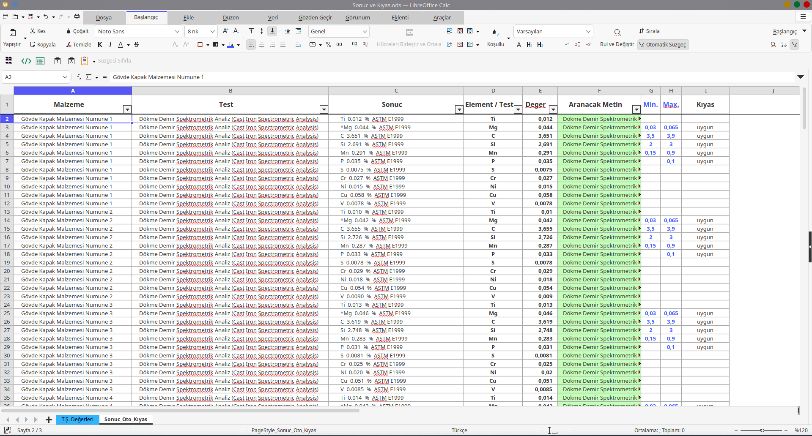

# PDF_to_TXT

## PDF'ten TXT'ye Dönüşüm ve Veri Madenciliği

Örnek **Analiz_Rapor.pdf** dosyası içindeki verileri, [PyPDF2](https://github.com/py-pdf/pypdf) kütüphanesi yardımıyla **pdf_verisi.txt** dosyasına aktarıyoruz.

Ardından [RE (Regular Expression (Düzenli İfadeler))](https://docs.python.org/3/library/re.html) kütüphanesi yardımıyla, aranan değerlere (desenlere) uygun çıktıları elde ederek konsola yazdırıyor ya da **Rapor_Degerleri.txt** isimli dosyaya kaydediyoruz.

***Örnek desenler;***

```python
desen_brinell_sertlik = r"Brinell\s+\d+\.\d+\s+HBW"
desen_cekme_gerilmesi = r"\(Rm\)\s+\d+\.\d+\s+N/mm\^2\s+EN ISO 6892-1 Metod B"
desen_kimyasal = r"\*?\w+\s+<?\d+\.\d+\s+%\s+ASTM E1999"
```

***Örnek Çıktılar;***

```python
Brinell   195.10  HBW
Brinell   193.21  HBW
Brinell   190.44  HBW

(Rm)   562.00  N/mm^2  EN ISO 6892-1 Metod B
(Rm)   558.00  N/mm^2  EN ISO 6892-1 Metod B
(Rm)   552.00  N/mm^2  EN ISO 6892-1 Metod B

Ti  0.042  %  ASTM E1999
*Mg  0.040  %  ASTM E1999
C  3.688  %  ASTM E1999
Si  2.513  %  ASTM E1999
Mn  0.388  %  ASTM E1999
P  0.041  %  ASTM E1999
S  0.0069  %  ASTM E1999
Cr  0.017  %  ASTM E1999
Ni  <0.010  %  ASTM E1999
Cu  0.155  %  ASTM E1999
V  0.021  %  ASTM E1999
```

## v0.4.2 (Teknolab);

Bu versiyonda **düzenli ifade metotları** yerine, **string metotları** kullanılarak sonuç elde edildi.

**Örnek Çıktı;**

```python
Gövde Kapak Malzemesi Numune 1|Dökme Demir Spektrometrik Analiz (Cast Iron Spectrometric Analysis)|Ti  0.011  %  ASTM E1999  |Ti|0,011
Gövde Kapak Malzemesi Numune 1|Dökme Demir Spektrometrik Analiz (Cast Iron Spectrometric Analysis)|*Mg  0.046  %  ASTM E1999  |Mg|0,046
Gövde Kapak Malzemesi Numune 1|Dökme Demir Spektrometrik Analiz (Cast Iron Spectrometric Analysis)|C  3.681  %  ASTM E1999  |C|3,681
Gövde Kapak Malzemesi Numune 2|Dökme Demir Spektrometrik Analiz (Cast Iron Spectrometric Analysis)|Si  2.625  %  ASTM E1999  |Si|2,625
Gövde Kapak Malzemesi Numune 2|Dökme Demir Spektrometrik Analiz (Cast Iron Spectrometric Analysis)|Mn  0.315  %  ASTM E1999  |Mn|0,315
Gövde Kapak Malzemesi Numune 2|Dökme Demir Spektrometrik Analiz (Cast Iron Spectrometric Analysis)|P  0.042  %  ASTM E1999  |P|0,042
Gövde Kapak Malzemesi Numune 3|Dökme Demir Spektrometrik Analiz (Cast Iron Spectrometric Analysis)|S  0.0063  %  ASTM E1999  |S|0,0063
Gövde Kapak Malzemesi Numune 3|Dökme Demir Spektrometrik Analiz (Cast Iron Spectrometric Analysis)|Cr  0.035  %  ASTM E1999  |Cr|0,035
Gövde Kapak Malzemesi Numune 3|Dökme Demir Spektrometrik Analiz (Cast Iron Spectrometric Analysis)|Ni  0.017  %  ASTM E1999  |Ni|0,017
Gövde Kapak Malzemesi Numune 4|Dökme Demir Spektrometrik Analiz (Cast Iron Spectrometric Analysis)|Cu  0.049  %  ASTM E1999  |Cu|0,049
Gövde Kapak Malzemesi Numune 4|Dökme Demir Spektrometrik Analiz (Cast Iron Spectrometric Analysis)|V  0.0086  %  ASTM E1999  |V|0,0086
Gövde Kapak Malzemesi Numune 5|Dökme Demir Spektrometrik Analiz (Cast Iron Spectrometric Analysis)|Cu  0.047  %  ASTM E1999  |Cu|0,047
Gövde Kapak Malzemesi Numune 5|Dökme Demir Spektrometrik Analiz (Cast Iron Spectrometric Analysis)|V  0.0098  %  ASTM E1999  |V|0,0098
Kilit Mekanizması Numune 1|Paslanmaz Çelik Spektrometrik Analiz|C  0.036  %  ASTM E1086  |C|0,036
Kilit Mekanizması Numune 1|Paslanmaz Çelik Spektrometrik Analiz|Si  0.430  %  ASTM E1086  |Si|0,430
Kilit Mekanizması Numune 2|Paslanmaz Çelik Spektrometrik Analiz|Mn  1.709  %  ASTM E1086  |Mn|1,709
Kilit Mekanizması Numune 2|Paslanmaz Çelik Spektrometrik Analiz|P  0.029  %  ASTM E1086  |P|0,029
Kilit Mekanizması Numune 3|Paslanmaz Çelik Spektrometrik Analiz|S  0.015  %  ASTM E1086  |S|0,015
Kilit Mekanizması Numune 3|Paslanmaz Çelik Spektrometrik Analiz|Cr  18.38  %  ASTM E1086  |Cr|18,38
Kilit Mekanizması Numune 4|Paslanmaz Çelik Spektrometrik Analiz|Ni  8.220  %  ASTM E1086  |Ni|8,220
Kilit Mekanizması Numune 4|Paslanmaz Çelik Spektrometrik Analiz|Mo  0.258  %  ASTM E1086  |Mo|0,258
Kilit Mekanizması Numune 5|Paslanmaz Çelik Spektrometrik Analiz|Cu  0.530  %  ASTM E1086  |Cu|0,530
Kilit Mekanizması Numune 5|Paslanmaz Çelik Spektrometrik Analiz|Fe+Diğer  Kalan  %  ASTM E1086  |Fe+Diğer|Kalan
Masfal Pimi Numune 1|Paslanmaz Çelik Spektrometrik Analiz|C  0.032  %  ASTM E1086  |C|0,032
Masfal Pimi Numune 1|Paslanmaz Çelik Spektrometrik Analiz|Si  0.425  %  ASTM E1086  |Si|0,425
Masfal Pimi Numune 2|Paslanmaz Çelik Spektrometrik Analiz|Mn  1.714  %  ASTM E1086  |Mn|1,714
Masfal Pimi Numune 2|Paslanmaz Çelik Spektrometrik Analiz|P  0.031  %  ASTM E1086  |P|0,031
Masfal Pimi Numune 3|Paslanmaz Çelik Spektrometrik Analiz|S  0.014  %  ASTM E1086  |S|0,014
Masfal Pimi Numune 3|Paslanmaz Çelik Spektrometrik Analiz|Cr  18.58  %  ASTM E1086  |Cr|18,58
Masfal Pimi Numune 4|Paslanmaz Çelik Spektrometrik Analiz|Ni  8.258  %  ASTM E1086  |Ni|8,258
Masfal Pimi Numune 4|Paslanmaz Çelik Spektrometrik Analiz|Mo  0.275  %  ASTM E1086  |Mo|0,275
Masfal Pimi Numune 4|Paslanmaz Çelik Spektrometrik Analiz|Cu  0.516  %  ASTM E1086  |Cu|0,516
Masfal Pimi Numune 4|Paslanmaz Çelik Spektrometrik Analiz|Fe+Diğer  Kalan  %  ASTM E1086  |Fe+Diğer|Kalan
Masfal Pimi Numune 5|Paslanmaz Çelik Spektrometrik Analiz|Cu  0.510  %  ASTM E1086  |Cu|0,510
Masfal Pimi Numune 5|Paslanmaz Çelik Spektrometrik Analiz|Fe+Diğer  Kalan  %  ASTM E1086  |Fe+Diğer|Kalan
Parsel Bacası Kapama Takımı Açma Anahtarı Numune 1|Paslanmaz Çelik Spektrometrik Analiz|C  0.038  %  ASTM E1086  |C|0,038
Parsel Bacası Kapama Takımı Açma Anahtarı Numune 1|Paslanmaz Çelik Spektrometrik Analiz|Si  0.442  %  ASTM E1086  |Si|0,442
Parsel Bacası Kapama Takımı Açma Anahtarı Numune 2|Paslanmaz Çelik Spektrometrik Analiz|Mn  1.686  %  ASTM E1086  |Mn|1,686
Parsel Bacası Kapama Takımı Açma Anahtarı Numune 2|Paslanmaz Çelik Spektrometrik Analiz|P  0.033  %  ASTM E1086  |P|0,033
Parsel Bacası Kapama Takımı Açma Anahtarı Numune 3|Paslanmaz Çelik Spektrometrik Analiz|S  0.016  %  ASTM E1086  |S|0,016
Parsel Bacası Kapama Takımı Açma Anahtarı Numune 3|Paslanmaz Çelik Spektrometrik Analiz|Cr  18.67  %  ASTM E1086  |Cr|18,67
Gövde Kapak Malzemesi Numune 1|ParametersAnaliz Sonuçları|Çekme Gerilmesi (Rm)   554.00  N/mm^2  EN ISO 6892-1 Metod B  |Çekme Gerilmesi (Rm)| 554,00
Gövde Kapak Malzemesi Numune 1|ParametersAnaliz Sonuçları|Rp0,2  401.00  N/mm^2  EN ISO 6892-1 Metod B  |Rp0,2|401,00
Gövde Kapak Malzemesi Numune 1|ParametersAnaliz Sonuçları|A5  10.00  %  EN ISO 6892-1 Metod B  |A5|10,00
Gövde Kapak Malzemesi Numune 2|ParametersAnaliz Sonuçları|Çekme Gerilmesi (Rm)   538.00  N/mm^2  EN ISO 6892-1 Metod B  |Çekme Gerilmesi (Rm)| 538,00
Gövde Kapak Malzemesi Numune 2|ParametersAnaliz Sonuçları|Rp0,2  392.00  N/mm^2  EN ISO 6892-1 Metod B  |Rp0,2|392,00
Gövde Kapak Malzemesi Numune 2|ParametersAnaliz Sonuçları|A5  8.000  %  EN ISO 6892-1 Metod B  |A5|8,000
Kilit Mekanizması Numune 1|ParametersAnaliz Sonuçları|Çekme Gerilmesi (Rm)   750.00  N/mm^2  EN ISO 6892-1 Metod B  |Çekme Gerilmesi (Rm)| 750,00
Kilit Mekanizması Numune 1|ParametersAnaliz Sonuçları|Rp0,2  521.00  N/mm^2  EN ISO 6892-1 Metod B  |Rp0,2|521,00
Kilit Mekanizması Numune 1|ParametersAnaliz Sonuçları|A5  39.00  %  EN ISO 6892-1 Metod B  |A5|39,00
EPDM - Conta Numune 1|ParametersAnaliz Sonuçları|*Kopma Mukavemeti   346.00  N/mm^2  TS ISO 37  |Kopma Mukavemeti| 346,00
EPDM - Conta Numune 1|ParametersAnaliz Sonuçları|*Uzama  11.00  %  TS ISO 37  |Uzama|11,00
EPDM - Conta Numune 5|ParametersAnaliz Sonuçları|*Kopma Mukavemeti   355.00  N/mm^2  TS ISO 37  |Kopma Mukavemeti| 355,00
EPDM - Conta Numune 5|ParametersAnaliz Sonuçları|*Uzama  10.00  %  TS ISO 37  |Uzama|10,00
```

## v0.4.3 (Teknolab);

Bu versiyonda, v.0.4.2 sürümünde elde ettiğimiz çıktıları (.tsv uzantılı dosya içeriğini) **Sonuc ve Kıyas.ods** dosyasına yapıştırarak, Sonuçların belirlenen Teknik Şartname değerlerine uygun olup olmadığını hızlı bir şekilde görebiliyoruz.



